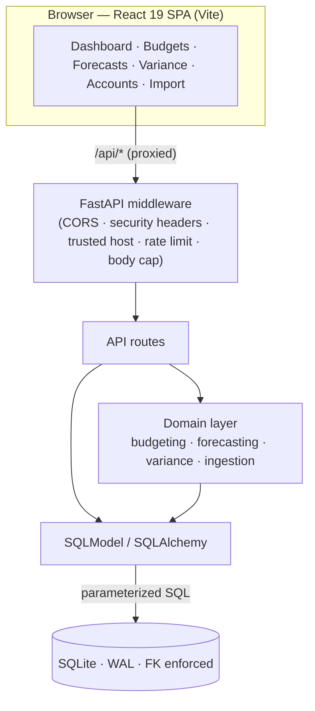

# OpenFP&A — Budgeting & Forecasting Tool

A **local-first, single-user** open-source FP&A tool that unifies three things no single
open-source tool offers together:

1. **Four corporate budgeting methods** — Incremental, Activity-Based (ABB),
   Value-Proposition (Priority-Based), and Zero-Based (ZBB) — as selectable derivation
   engines, wrapped by orthogonal **Static/Flexible** and **Periodic/Rolling** modifiers.
2. **Autonomous statistical forecasting** — auto-selected ARIMA/SARIMA, ETS/Holt-Winters,
   Theta/CES and Prophet (plus transparent classic FP&A methods), chosen per series by
   **rolling-origin backtesting** ranked on **MASE**, with prediction intervals.
3. **Rigorous variance analysis** — budget-vs-actual plus full price / volume / mix /
   efficiency decomposition, with a sign-safe favorable/unfavorable engine and a waterfall
   bridge.

Data goes in **manually** (editable accounts × periods grid) or via **CSV/Excel template
upload** (wide or long layout).

> **License posture:** the distributable is **MIT**, and every dependency is OSI-permissive
> (MIT / BSD / Apache-2.0). A CI license gate fails the build on any GPL/AGPL/SSPL/BSL or
> commercial dependency. See [NOTICE](NOTICE).

## Documentation

- **[docs/ARCHITECTURE.md](docs/ARCHITECTURE.md)** — visual tour (Mermaid diagrams): system
  overview, request security pipeline, data model, forecasting/budgeting/variance flows.
- **[docs/DESIGN.md](docs/DESIGN.md)** — the implementation-ready build brief (the four
  budgeting algorithms, the forecasting auto-selection pipeline, the *verified* variance
  formulas, the data model, the stack, and the phased plan).
- **[docs/COMBINATIONS.md](docs/COMBINATIONS.md)** — the full budgeting × forecasting × variance
  combination space.
- **[docs/RESEARCH_APPENDIX.md](docs/RESEARCH_APPENDIX.md)** — raw research dossiers, the
  adversarial verification verdicts, and all 169 cited sources.
- **[SECURITY.md](SECURITY.md)** · **[CONTRIBUTING.md](CONTRIBUTING.md)** ·
  **[CODE_OF_CONDUCT.md](CODE_OF_CONDUCT.md)**

## Architecture at a glance



The full set of diagrams — request security pipeline, ER model, forecasting auto-selection,
budgeting engines, variance flow, ingestion — lives in
**[docs/ARCHITECTURE.md](docs/ARCHITECTURE.md)**.

## Repository layout

```
backend/    FastAPI + SQLite (the FP&A engine lives here)
  app/
    api/routes/     HTTP endpoints
    db/             SQLModel models + session (SQLite, WAL)
    domain/
      budgeting/    4 engines + Static/Flexible + Rolling modifiers
      forecasting/  classic methods, baselines, metrics, rolling-origin auto-select, intervals
      variance/     sign engine, budget-vs-actual, cost & sales variances, materiality, bridge
      ingestion/    upload parse -> validate -> pivot wide->long -> upsert
  tests/            unit tests (the DESIGN.md worked examples are the fixtures)
frontend/   React + Vite + TypeScript SPA
docs/       design brief, research appendix, upload templates
```

## Quick start

> On Windows `cmd`/PowerShell, run each command on its own line — don't paste a trailing
> `# comment`, since `#` is not a comment marker there and gets passed to the program.

### One command — start both servers

Launcher scripts at the repo root install dependencies, seed the demo database, and start the
backend (`:8000`) and frontend (`:5173`) together:

| OS | First run (setup + start) | Subsequent starts |
| --- | --- | --- |
| **Windows** | double-click **`setup_and_start.bat`** | **`start.bat`** |
| **macOS / Linux** | `./setup.sh` | `./start-bg.sh` (background) |

On macOS/Linux: `./start-bg.sh stop` / `restart` / `status` manage the background servers (logs go
to `logs/`). Then open <http://127.0.0.1:5173>. To run the services by hand instead, use the steps
below.

### Backend

```
cd backend
python -m venv .venv
.venv\Scripts\activate
pip install -e ".[dev]"
python scripts/seed.py
uvicorn app.main:app --reload --reload-dir app
```

- macOS/Linux: activate with `source .venv/bin/activate`.
- Add the heavy statistical models with `pip install -e ".[dev,forecasting]"`.
- `pytest` runs the tests. API at http://127.0.0.1:8000 , docs at `/docs`.
- **`--reload-dir app` is important:** plain `--reload` watches `.venv` too, and if the project is
  in a synced folder (Dropbox/OneDrive), the sync churn makes uvicorn reload endlessly. Scoping to
  `app` fixes it; `uvicorn app.main:app` with no reload also works.

### Frontend

```
cd frontend
npm install
npm run dev
```

Dev server at http://127.0.0.1:5173, proxying `/api` to the backend on port 8000.

## Security

This is a **local-first, single-user** tool (binds to localhost; data in a local SQLite file) and
ships no built-in authentication — do not expose it directly to the internet without an
authenticating reverse proxy. It does, however, apply defence-in-depth:

- **App layer** ([`backend/app/security.py`](backend/app/security.py)) — OWASP secure headers
  (CSP, anti-clickjacking, nosniff, referrer/permissions policy, cross-origin isolation, optional
  HSTS), a host allow-list, strict CORS, a request body-size cap, and per-IP rate limiting. All
  tunable via `OPENFPA_*` env vars.
- **Data layer** — parameterized SQLModel/SQLAlchemy queries (no SQL injection), money as integer
  minor units in `Decimal`, SQLite with foreign keys + WAL.
- **Supply chain / CI** — CodeQL, Dependabot, secret scanning (gitleaks, blocking), `pip-audit` +
  `npm audit`, OpenSSF Scorecard, and a license gate that fails on GPL/AGPL/SSPL/BSL/commercial deps.

Found a vulnerability? Please report it **privately** — see **[SECURITY.md](SECURITY.md)**.

## Contributing

Contributions are welcome — see **[CONTRIBUTING.md](CONTRIBUTING.md)** for dev setup, the CI gates
your PR must pass, coding standards, and the DCO sign-off. Please also follow the
[Code of Conduct](CODE_OF_CONDUCT.md).

- Bugs & features: [open an issue](https://github.com/himanshusharma75035-sudo/budgeting-and-forecasting-tool/issues/new/choose)
- Maintainer: Himanshu Sharma — <Himanshusharma75035@gmail.com>

## Status

This is the **scaffold + research** deliverable. The deterministic FP&A logic (all four
budgeting engines, the variance formulas, the classic forecasting methods + naive baselines +
metrics + rolling-origin auto-selection) is **implemented and unit-tested**. The heavy
statistical models (statsforecast / Prophet) sit behind an optional `forecasting` extra with a
clean interface, and the React UI is a routable skeleton wired to the API. See the phased plan
(M0–M6) in [docs/DESIGN.md](docs/DESIGN.md#8-phased-build-plan).
