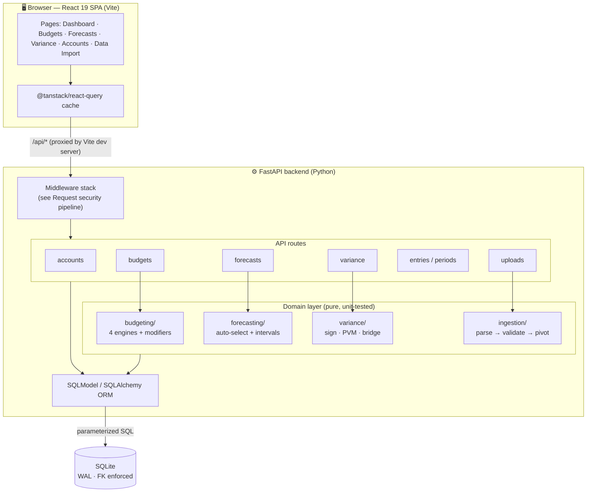
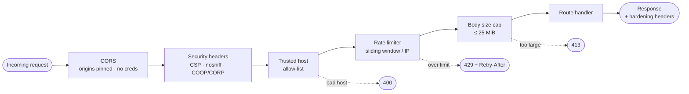
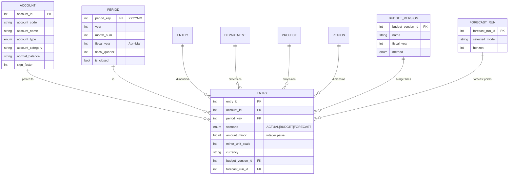
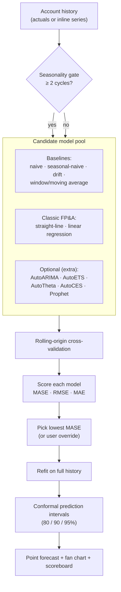
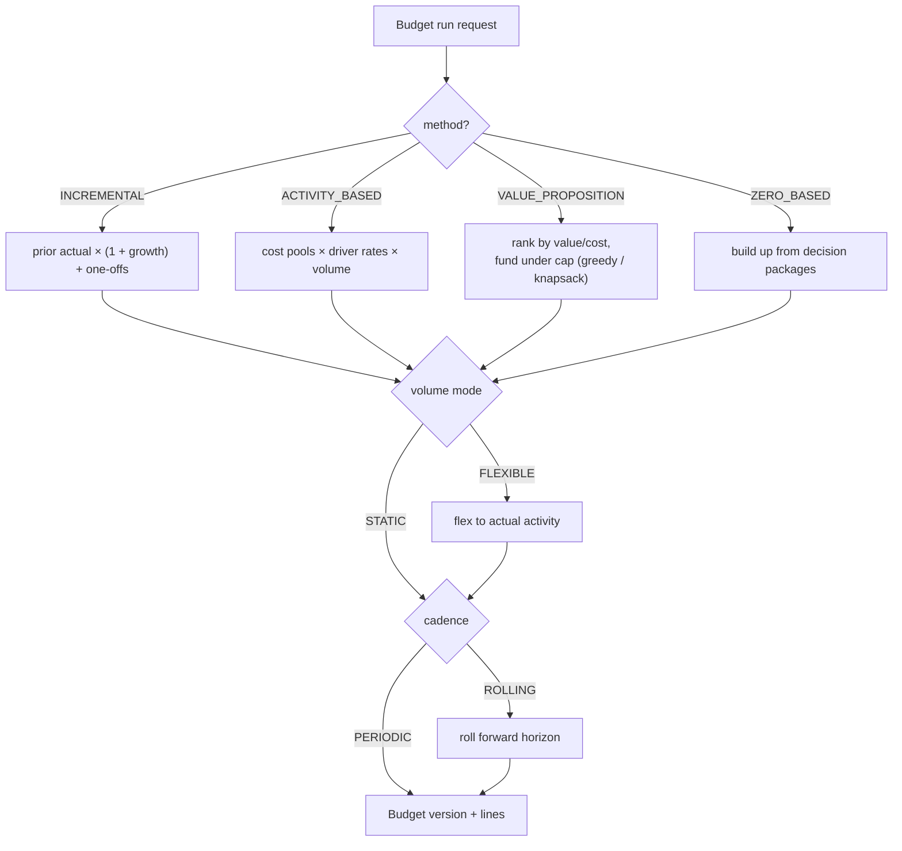
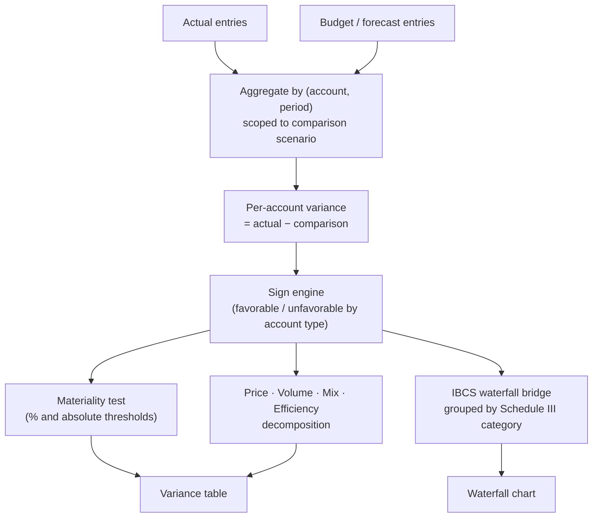
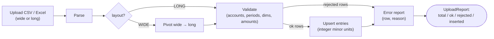
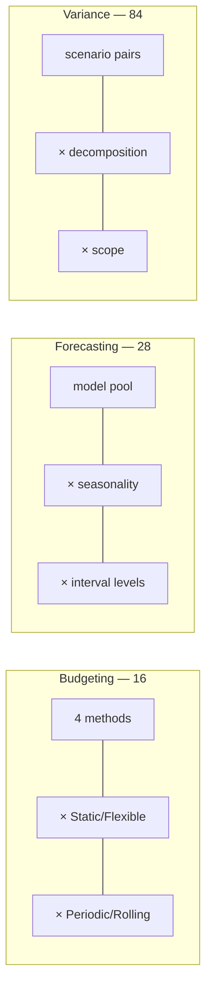

# Architecture

A visual tour of how the tool is put together. All diagrams are [Mermaid](https://mermaid.js.org/)
and render natively on GitHub.

- [System overview](#system-overview)
- [Request security pipeline](#request-security-pipeline)
- [Data model](#data-model)
- [Forecasting auto-selection](#forecasting-auto-selection)
- [Budgeting engine selection](#budgeting-engine-selection)
- [Variance analysis flow](#variance-analysis-flow)
- [Data ingestion pipeline](#data-ingestion-pipeline)
- [Combination space](#combination-space)

---

## System overview

---

## Request security pipeline

Every request passes through defence-in-depth middleware before reaching a route. Starlette applies
the **last-added middleware outermost**, so the effective request order is:

See [`backend/app/security.py`](../backend/app/security.py) and [SECURITY.md](../SECURITY.md).

---

## Data model

A star-ish schema: postings (`Entry`) reference a chart of accounts and four dimensions, scoped by
scenario and optionally a budget version or forecast run.

Money is stored as **integer minor units** (paise) and computed in `Decimal` — never `float`.

---

## Forecasting auto-selection

Each series is forecast by the model that wins a **rolling-origin backtest**, ranked on **MASE**,
then wrapped with prediction intervals.

---

## Budgeting engine selection

Four derivation engines are wrapped by two orthogonal modifiers — **volume** (static vs flexible)
and **cadence** (periodic vs rolling).

---

## Variance analysis flow

---

## Data ingestion pipeline

---

## Combination space

The selectable options multiply into a large, well-defined space — enumerated in
[COMBINATIONS.md](COMBINATIONS.md).

